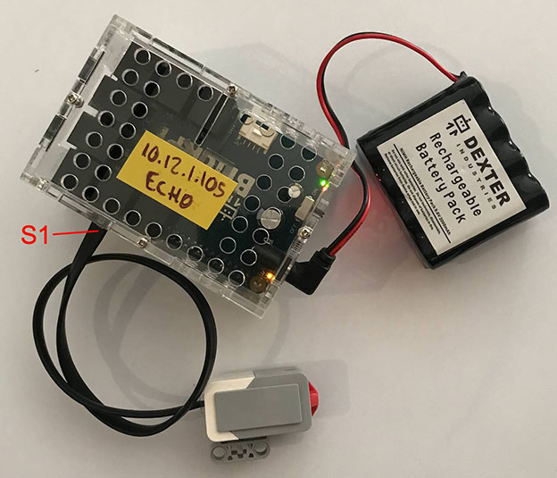

# Dexter BrickPi and the Touch Sensor

A Python snippet utilizing the LEGO EV3 touch sensor, the Dexter BrickPi and [BrickPi3](https://github.com/DexterInd/BrickPi3). [BrickPi3](https://github.com/DexterInd/BrickPi3) is the Dexter recommended method of using the BrickPi with Python. 

This example turns on the Raspberry Pi on board LED when the touch sensor is pushed.

This example requires the [Remote Development](https://marketplace.visualstudio.com/items?itemName=ms-vscode-remote.vscode-remote-extensionpack) VS Code extension to be installed.

***

## Repo Resources

* [Dexter BrickPi](https://www.dexterindustries.com/BrickPi/)
* [BrickPi3](https://github.com/DexterInd/BrickPi3)
* [Remote Development](https://marketplace.visualstudio.com/items?itemName=ms-vscode-remote.vscode-remote-extensionpack)

 

